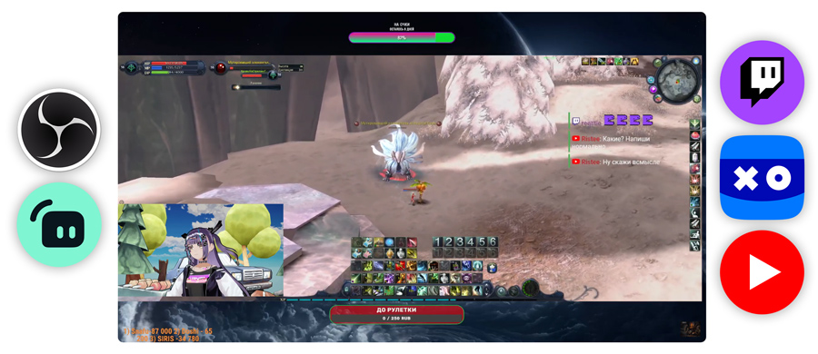

# Multichannel Comment Aggregator for Live Streams

This project is designed as a comprehensive solution for aggregating live chat comments from multiple streaming platforms, specifically YouTube, VK Play, and Twitch. Whether you are a content creator looking to enhance your live streaming experience or a developer aiming to integrate chat functionalities into your system, this project provides the necessary tools. It enables seamless collection and display of live chat data, ideal for embedding a real-time chat widget in OBS or other broadcasting software. With this tool, streamers can gather audience interactions across various platforms and showcase them collectively as a unified chat widget for OBS or integrate them directly into their stream overlays.

The setup includes a Python-based comment parser that interacts with streaming APIs and websites to pull live messages and send them to a server. On the server side, PHP scripts store and handle chat data, which can then be displayed in a customizable web widget. This makes it perfect for live stream setups, OBS chat widgets, multi-platform stream chat integration, and interactive overlays. Streamers on platforms like Twitch and VK Play, who need a consolidated chat for engagement, will find this tool invaluable.
## Table of Contents

- [Features](#features)
- [Requirements](#requirements)
- [Installation](#installation)
- [Configuration](#configuration)
- [Usage](#usage)
- [Project Structure](#project-structure)
- [License](#license)
- [Author](#author)

## Features

- Multichannel support: YouTube, VK Play, and Twitch.
- Collects comments in real-time.
- Sends data to a server for storage and display.
- Customizable and easily extendable.

## Requirements

- Python 3.10
- PHP 7.4 or higher
- MariaDB or MySQL
- Playwright (for Python)

## Installation

### Step 1: Set Up the Server

1. Create a database in MariaDB/MySQL.
2. Import the `chat.sql` file to set up the database structure.
3. Configure the `options.php` file with your database connection settings.

### Step 2: Configure and Run the Client

1. Clone the repository:

   ```bash
   git clone https://github.com/lowdigital/live-multichat.git
   cd live-multichat/local
   ```

2. Set up the Python environment:

   ```bash
   python -m venv venv
   venv\Scripts\activate
   ```

3. Install dependencies:

   ```bash
   pip install -r requirements.txt
   ```

4. Configure the `app.py` file:
   - Replace `YOUTUBE_CHANNEL_URL`, `VK_PLAY_URL`, and `TWITCH_URL` with your channel URLs.
   - Set `POST_URL` to point to the server endpoint (e.g., `https://YOUR-DOMAIN.COM/get.php`).

5. Run the `run.bat` script to start the comment aggregation

### Step 3: Deploy the Server Files

1. Copy the contents of the `cloud` folder to your server's web directory.
2. Ensure PHP is configured and accessible via the web server.
3. Set proper permissions for `options.php` to secure your database credentials.

## Configuration

### Python Configuration

Edit `app.py` to set:

- `YOUTUBE_CHANNEL_URL`, `VK_PLAY_URL`, `TWITCH_URL` - URLs of the channels/streams.
- `POST_URL` - URL for the server endpoint to receive data.

### PHP Configuration

Edit `cloud/options.php`:

```php
<?php
    $host = 'your-database-host';
    $user = 'your-database-user';
    $pass = 'your-database-password';
    $db = 'your-database-name';
?>
```

## Usage

- Launch the script on the client machine to start collecting comments.
- Access `widget.php` from your web server to see the chat feed.

## Project Structure

```
live-multichat/
│
├── local/
│   ├── app.py
│   ├── run.bat
│   ├── requirements.txt
│
└── cloud/
    ├── api.php
    ├── get.php
    ├── options.php
    ├── widget.php
    └── chat.sql
│
└── README.md
```

## License

This project is licensed under the MIT License.

## Author

Follow updates on my Telegram channel: [low digital](https://t.me/low_digital).
